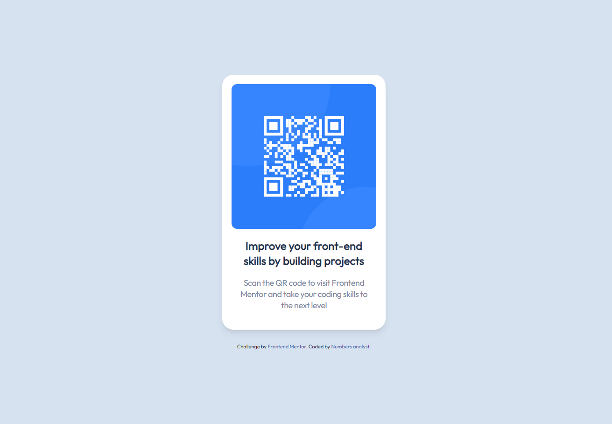

# QR Code Component - Frontend Mentor Challenge

That project is my solution to the QR code component challenge on Frontend Mentor. I build it with Astro, HTML and Tailwind CSS.

## Screenshot:

## Live Demo:

[Github Pages](https://numbersanalyst.github.io/qr-code/)

## License

This project is licensed under the [MIT License](LICENSE).